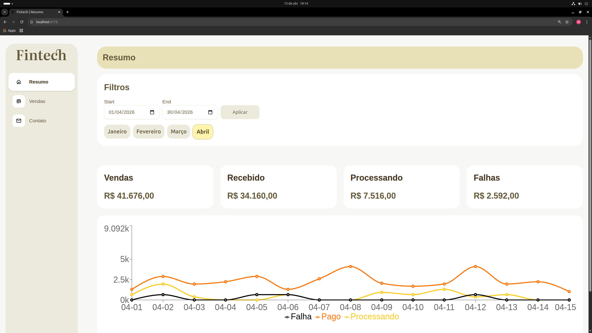
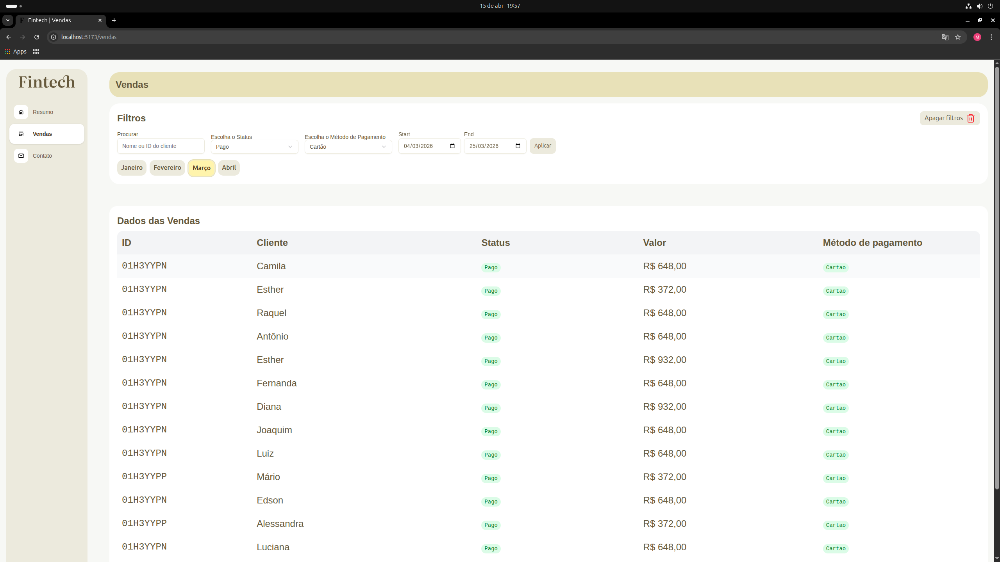
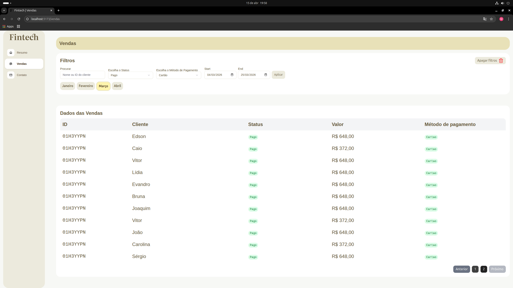

# 💰 Fintech Dashboard

Dashboard de vendas com filtros avançados, gráficos e paginação, desenvolvido com React, TypeScript, React Query e Zustand.

## 📸 Preview do sistema





## 🚀 Funcionalidades

- 📊 Visualização de dados de vendas
- 🔍 Filtros por data e cliente
- 📄 Paginação de resultados
- ⚡ Gerenciamento de estado global com Zustand
- 🔄 Fetch de dados com React Query
- 📱 Layout responsivo (mobile + desktop)
- ❌ Tratamento de erros com Error Boundary

## 🛠️ Tecnologias

- React
- TypeScript
- React Query
- Zustand
- Tailwind CSS
- Vite

## 📂 Estrutura do Projeto

### src/

- **components/** → Componentes reutilizáveis (UI)
  - **ui/** → Componentes genéricos (botões, inputs, etc)
  - **layout/** → Estrutura da aplicação (header, sidebar, etc)
  - **filters/** → Componentes de filtros

- **pages/** → Páginas da aplicação (rotas)

- **hooks/** → Hooks customizados

- **services/** → Requisições e integração com API

- **store/** → Estado global (Zustand)

- **types/** → Tipagens globais (TypeScript)

- **utils/** → Funções auxiliares

- **routes/** → Configuração de rotas

- **App.tsx** → Componente principal da aplicação


## ⚙️ Como rodar o projeto

```bash
# Clone o repositório
git clone https://github.com/MoisesBarrosDev/fintech.git

# Entre na pasta
cd fintech

# Instale as dependências
npm install


# Rode o projeto 
npm run dev